# Maxsun B760ITX / i5-13600K / RX 6600 XT Hackintosh

铭瑄 MS-B760ITX + Intel Core i5-13600K + AMD Radeon RX 6600 XT 的 OpenCore EFI。

> 仓库名称保留了早期使用的 RX580；从 1.0.6 起，当前维护和实机验证的显卡为 RX 6600 XT。

## 当前版本 / Current release

### 1.0.7（2026-08-10）

- OpenCore：1.0.7 RELEASE
- 实测系统：macOS Sequoia 15.6.1（24G90）
- SMBIOS：MacPro7,1
- 发布包：[1.0.7/EFI-OpenCore-1.0.7.zip](1.0.7/EFI-OpenCore-1.0.7.zip)
- SHA-256：`c8feb233f68795aafae7160acb49f87eb4ae79269047c83493ddae902ef8974d`

本版以当前实机正常启动并完成锁屏显示唤醒测试的 EFI 为基线：

- 更新 OpenCore 到 1.0.7，并确认 `OpenCore.efi`、`BOOTx64.efi` 与官方 RELEASE 完全一致。
- 更新 Lilu 1.7.3、WhateverGreen 1.7.1、VirtualSMC 1.3.8、AppleALC 1.9.8 等核心驱动。
- 使用 CpuTopologyRebuild 2.0.2、CPUFriend 和定制数据处理 13 代 Intel 大小核调度与功耗。
- RX 6600 XT 使用 `agdpmod=pikera`，同时屏蔽 Intel 核显。
- 为 RX 6600 XT 注入 `CFG,CFG_USE_AGDC = false`，修复双 DisplayPort 显示器锁屏熄屏后，唤醒登录界面卡死的问题。
- OpenCore 图形化启动选择器可以显示 macOS、Windows、Recovery 等启动项。
- 清理旧版未使用的 ACPI、驱动和 Kext；发布包不包含 `.DS_Store`、AppleDouble 元数据及无关的 Apple 固件更新缓存。
- 发布包已用 OpenCore 1.0.7 官方 `ocvalidate` 校验通过。

## 硬件配置 / Hardware

| 设备 | 当前配置 |
| --- | --- |
| 主板 | 铭瑄 Maxsun MS-B760ITX |
| CPU | Intel Core i5-13600K（6P + 8E） |
| 核显 | Intel UHD 770，macOS 下禁用 |
| 独显 | AMD Radeon RX 6600 XT 8GB |
| 内存 | Kingston DDR4-3200 32GB（16GB × 2） |
| macOS SSD | aigo P7000Z 2TB NVMe |
| Windows SSD | KIOXIA EXCERIA G2 500GB NVMe |
| 有线网卡 | Realtek RTL8125 2.5GbE |
| 无线与蓝牙 | Broadcom BCM94360CD |

当前为双硬盘双系统：macOS 独占 2TB aigo SSD，Windows 安装在独立的 KIOXIA SSD，由 OpenCore 统一选择启动。

## 实机验证状态 / Validation

- macOS 冷启动、重启和关机：正常。
- OpenCore 图形化启动选择器及 Windows 双系统引导：正常。
- RX 6600 XT 图形加速、Metal：正常。
- 双 DisplayPort 输出：正常。
  - ViewSonic VX2780-4K-HDU：3008 × 1692 HiDPI，60Hz，30-bit。
  - Dell P2419H：945 × 1680 HiDPI，竖屏 90°，60Hz，30-bit。
- 锁屏后显示器熄灭、鼠标点亮、密码解锁：已完成两轮实测，正常。
- RTL8125 2.5GbE：正常。
- BCM94360CD：使用 Sequoia 所需的 Legacy Wi-Fi 兼容驱动。
- USB：使用本机定制 `USBPorts.kext`；其他机箱和前置接口需自行重新定制。

### 尚未作为“已验证”承诺的项目

- 整机自动睡眠和长时间深度睡眠没有完成长期压力测试。
- 当前使用 `hibernatemode 0`，不提供原生休眠/休眠镜像保证。
- 不同显示器、DP 线材、显卡 VBIOS 或 BIOS 版本可能产生不同的唤醒表现。

## 使用前必须处理三码 / SMBIOS identifiers

公开发布包不会包含本机正在使用的三码，以下字段已替换为 OpenCore 官方 Sample.plist 的无效占位值：

- `MLB`
- `ROM`
- `SystemSerialNumber`
- `SystemUUID`

首次使用前，请使用 [GenSMBIOS](https://github.com/corpnewt/GenSMBIOS) 为 `MacPro7,1` 生成自己的信息，并写入 `EFI/OC/config.plist`。不要把正在使用的三码提交到公开仓库。

## 安装与升级 / Installation

1. 备份当前能启动的 EFI，并准备一个可恢复的 FAT32 U 盘 EFI。
2. 解压最新发布包，将其中的 `EFI/BOOT` 和 `EFI/OC` 复制到目标 EFI 分区。
3. 写入自己的 `MacPro7,1` 三码。
4. 检查 BIOS 设置后，从 U 盘先试启动；确认 macOS、Windows 和 Recovery 都能进入，再替换硬盘 EFI。
5. EFI 大版本更新后，可在 OpenCore 选择器中执行一次 Reset NVRAM，再重新选择默认启动项。

## BIOS 设置 / BIOS settings

以下为当前机器使用的基础方向；不同 BIOS 版本的菜单名称可能不同：

- Hyper-Threading：Enabled
- VT-d：Disabled
- Above 4G Decoding：Enabled
- Resizable BAR：Enabled
- Serial/COM Port：Disabled
- EHCI/XHCI Hand-off：Enabled
- CSM：Disabled
- Fast Boot：Disabled
- Secure Boot：Disabled

## 主要驱动版本 / Main kext versions

| Kext | 版本 |
| --- | --- |
| Lilu | 1.7.3 |
| WhateverGreen | 1.7.1 |
| VirtualSMC | 1.3.8 |
| AppleALC | 1.9.8 |
| CpuTopologyRebuild | 2.0.2 |
| CPUFriend | 1.3.1 |
| RestrictEvents | 1.1.7 |
| HibernationFixup | 1.5.5 |
| RTL812xLucy | 1.1.1 |
| RadeonSensor / SMCRadeonGPU | 0.3.3 |

## 历史版本 / Previous releases

### 1.0.6

- 更换为 RX 6600 XT。
- 支持 macOS 15.6.1 的开发版 EFI；已由 1.0.7 正式基线替代。

### 1.0.0

- 支持到 macOS 14.5。
- 修复 Type-C 音频设备识别问题。

### 0.9.5

- 调整 OpenCore 配置和 CPU 频率表现。
- 该版本的睡眠结论仅适用于当时的 RX580 和系统版本。

## 截图 / Screenshots

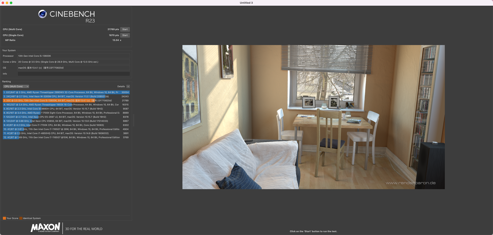
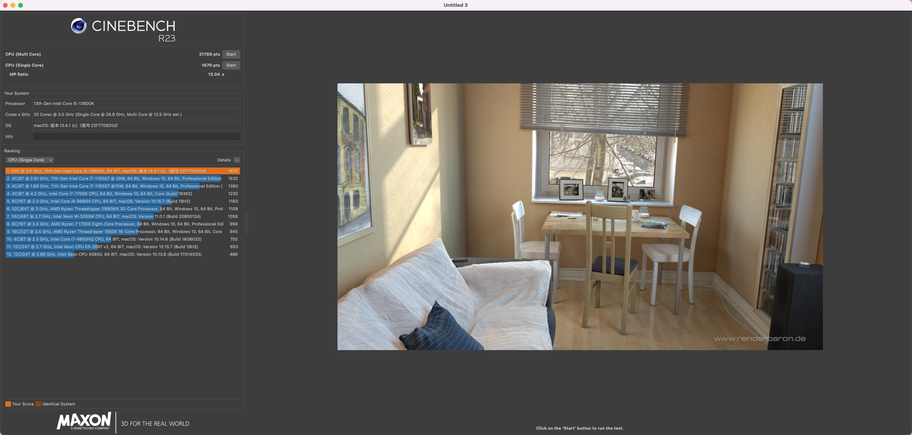
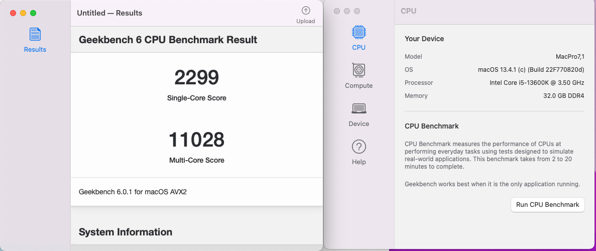
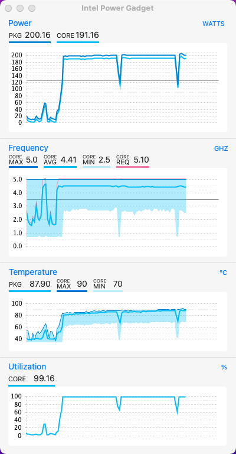
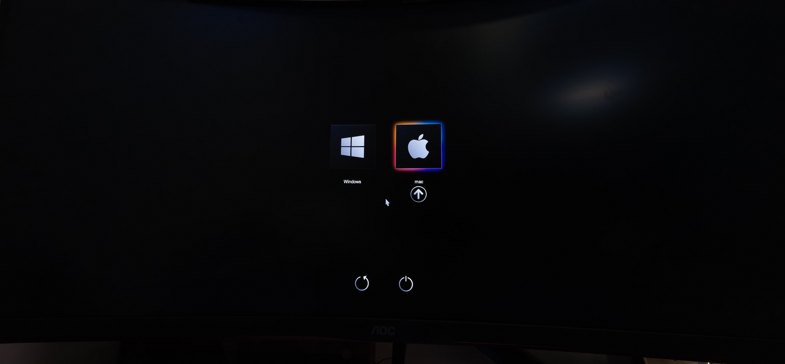
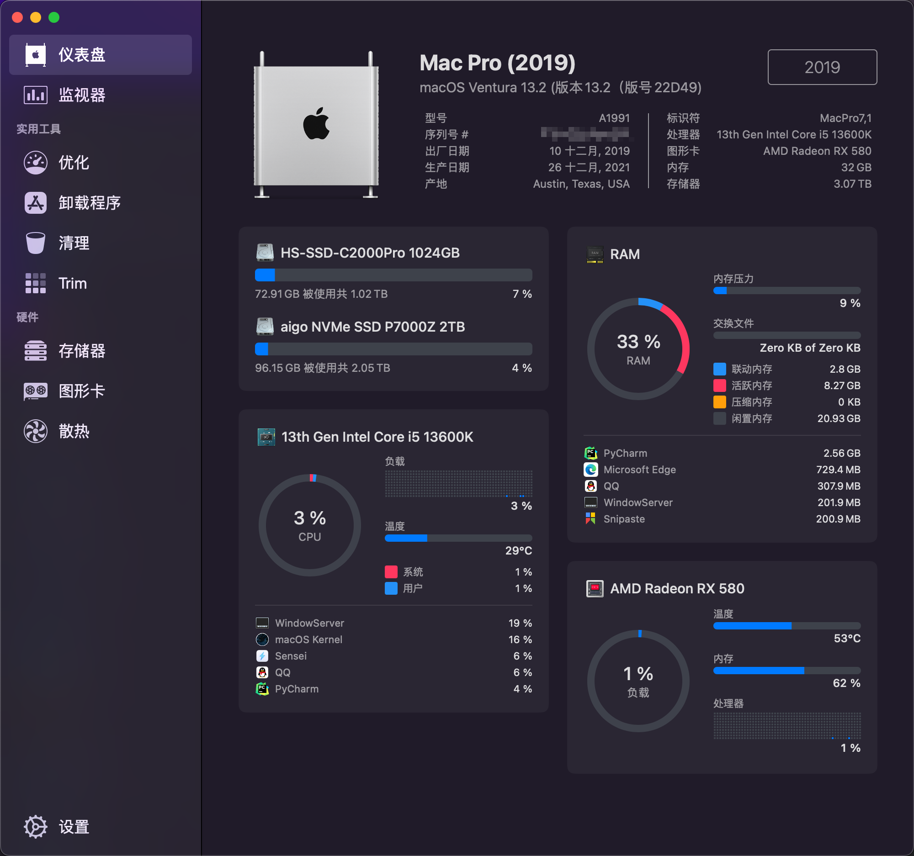
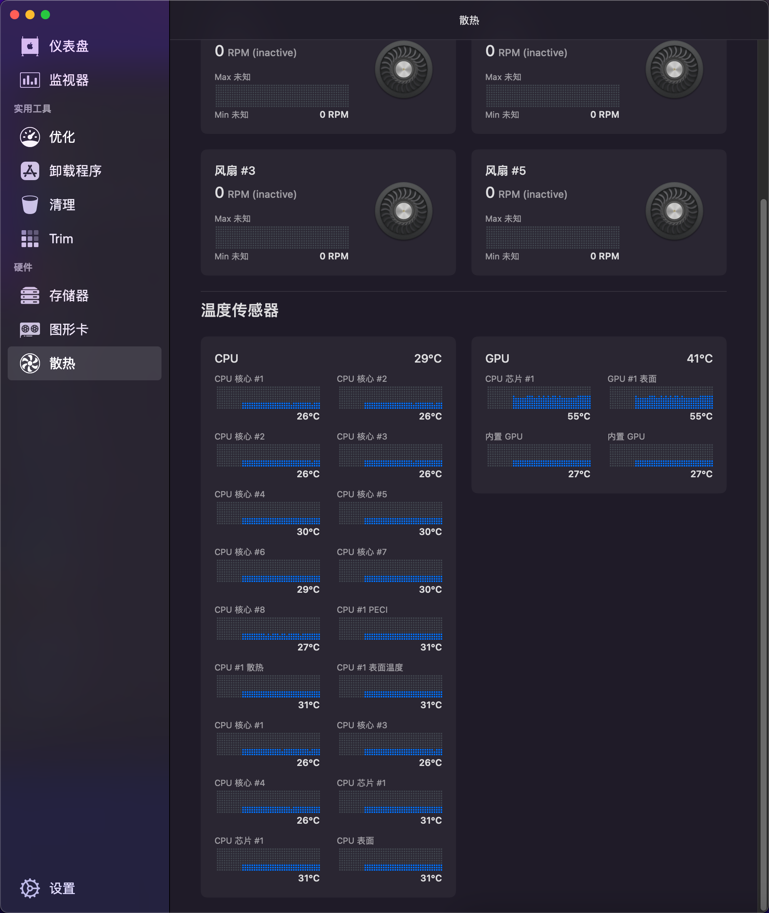
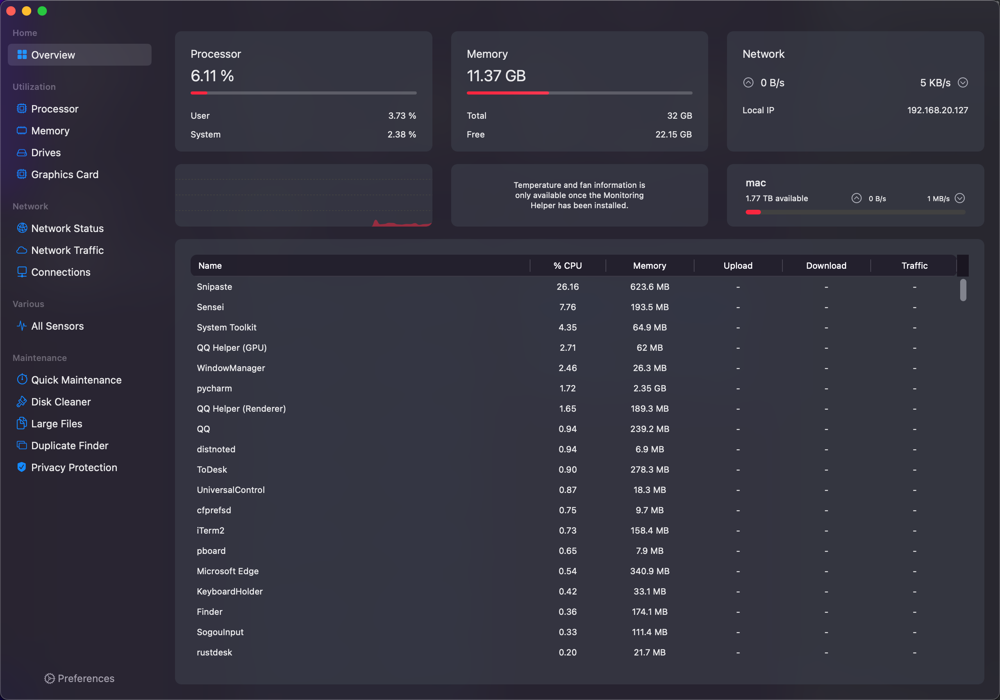
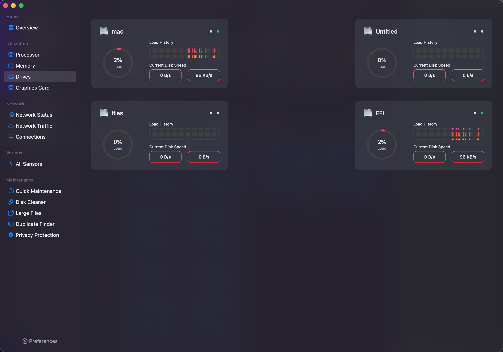
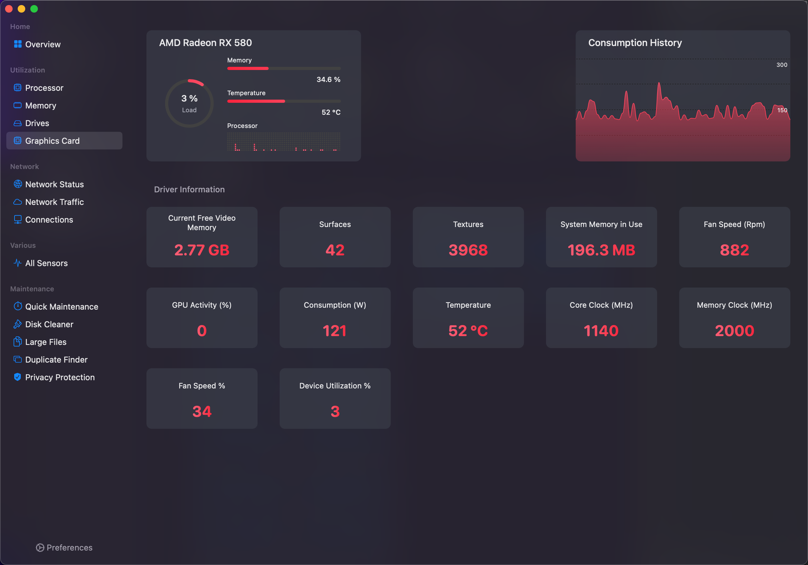
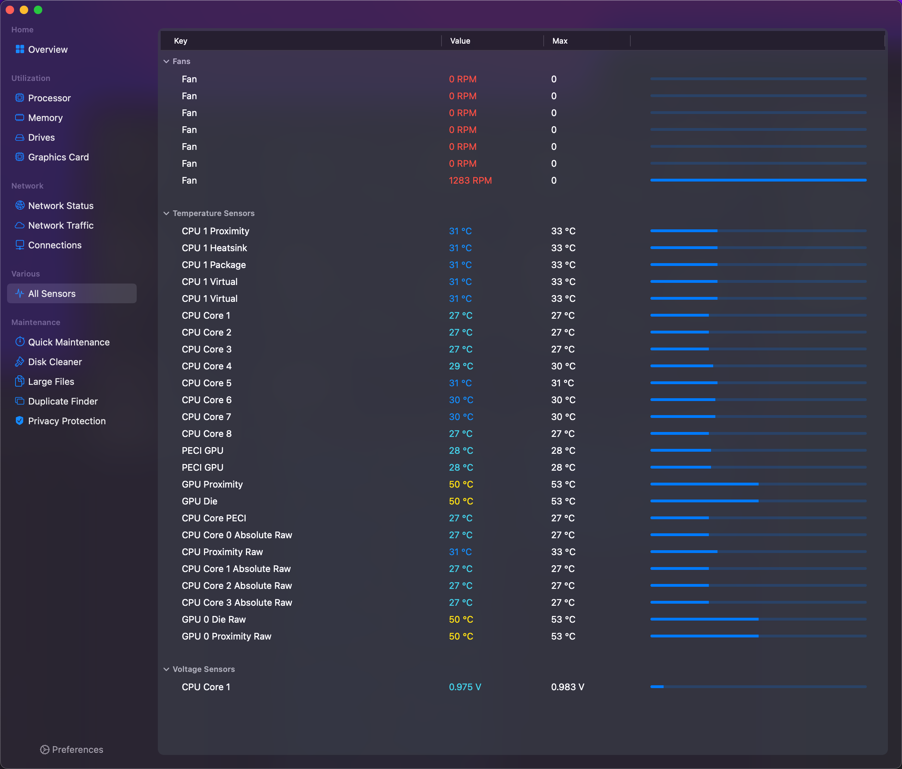
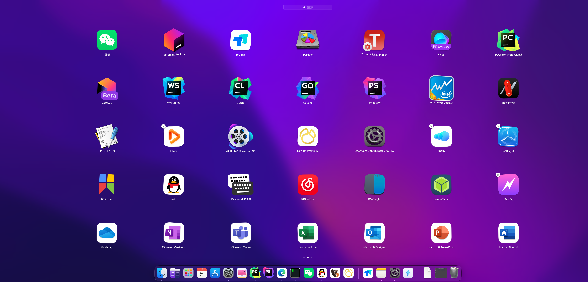
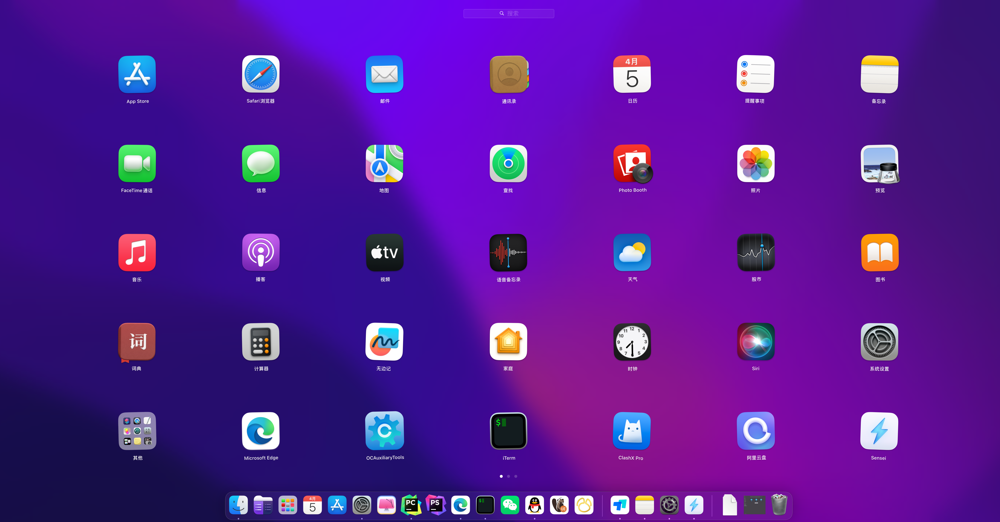
