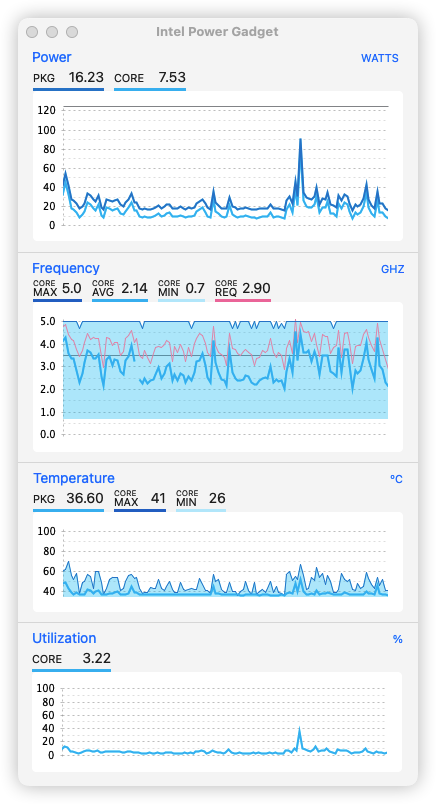

# Hackintosh-Maxsun-B760itx-13600k-RX580
# 铭瑄Maxsun B760itx主板黑苹果OC引导

## 机器配置
主板：铭瑄 MS-B760ITX
CPU：i5-13600k (带核显加了屏蔽参数)

显卡： RX580 8G 满血版本（免驱动安装）

内存：金士顿骇客神条 32G DDR4 3200 16x2

硬盘： 爱国者S7000z 2T

无线网卡&蓝牙： BCM94360CD (苹果原装拆机卡) 

### 1.0.0版本更新
- 最高支持到14.5版本
- 修复了type-c连接耳机的问题
- 问题：测试长期休眠有问题

### 0.9.5版本更新
- 修改了oc相关配置，测试两天，睡眠完美
- cpu核心最高5.0，跑分正常, 内存频率偏低跑分低

### BIOS Settings
BIOS使用最新版本
* 开启Hyper-Threading
* 关闭VT-d
* 开启Above 4G decoding
* 开启Resizable Bar
* 关闭Device Security Support
* 关闭Serial/COM Port
* 开启EHCI/XHCI Hand-off
* 关闭CSM Support
* 关闭Fast Boot
* 关闭Secure Boot

### 补充说明
1. USB驱动基本完美，本人机箱没有前置接口，所以没进行定制，需要的话请自行修改
2. typec 链接耳机无法进行识别，其他正常（有能解决的欢迎提交pr或是issue
3. 原装网卡已经拆卸，未使用，需要的请自行参考文档解决
4. 三码请自行生成，内部三码仅供参考；
   三码生成工具 https://github.com/corpnewt/GenSMBIOS/archive/refs/heads/master.zip
5. 内置了主题 blackosx\BsxM1： https://github.com/blackosx/BsxM1
6. 关闭了版本号显示和recovery的显示，需要请自行打开
7. 由于加了风扇控制器所以无法获取转速，水泵是直插主板的可以显示转速
8. 未添加-v参数，初次安装调试请自行添加

### 截图

